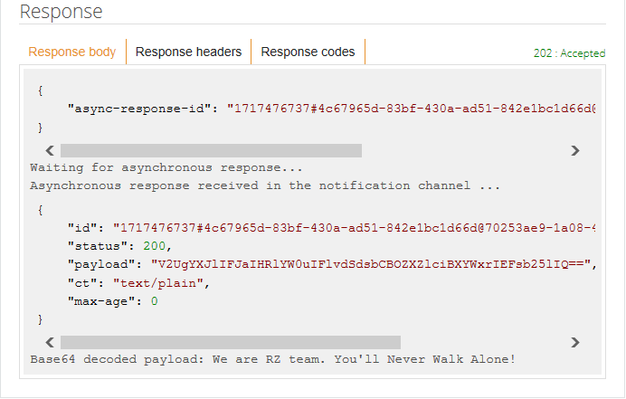

# Getting started with mbed Client on mbed OS

This is the mbed Client example for mbed OS (we also have one for [Linux](https://github.com/ARMmbed/mbed-client-linux-example)). It demonstrates how to register a device with mbed Device Connector, how to read and write values, and how to deregister. If you are unfamiliar with mbed Device Connector, we recommend that you read [the introduction to the data model](https://docs.mbed.com/docs/mbed-device-connector-web-interfaces/en/latest/#the-mbed-device-connector-data-model) first.

The application:

* Connects to network with WiFi or Ethernet.
* Registers with mbed Device Connector.
* Gives mbed Device Connector access to its resources (read and write).
* Records the number of clicks on the device’s button and sends the number to mbed Device Connector.
* Lets you control the blink pattern of the LED on the device (through mbed Device Connector).

## Required hardware

* [Renesas GR-LYCHEE](https://developer.mbed.org/platforms/Renesas-GR-LYCHEE/).
* 1-2 micro-USB cables.
* Ethernet cable is unnecessay(This board connect to internet by using Wifi module is incorporated).

## Required software

* [ARM mbed account](https://developer.mbed.org/account/login/?next=/).
* [mbed-cli](https://github.com/ARMmbed/mbed-cli) - to build the example programs. To learn how to build mbed OS applications with mbed-cli, see [the user guide](https://github.com/ARMmbed/mbed-cli/blob/master/README.md).
* [Serial port monitor](https://developer.mbed.org/handbook/SerialPC#host-interface-and-terminal-applications).

## Application setup

To configure the example application, please:

1. [Select the connection type](#connection-type).
1. [Set the client credentials](#client-credentials).
1. [Change Wi-Fi settings](#wi-fi-settings).

### Connection type

The application uses "NO_CONNECT" as the default connection type. To change the connection type, set one of them in `mbed_app.json`. For example, to enable WIFI_ESP32 mode:

```json
    "network-interface":{
        "help": "Options are ETHERNET, WIFI_IDW0XX1, WIFI_ESP8266, WIFI_BP3595, WIFI_ESP32, WIFI_ISM43362, WIFI_ODIN, WIFI_WIZFI310, MESH_LOWPAN_ND, MESH_THREAD, CELLULAR_ONBOARD, NO_CONNECT",
        "value": "WIFI_ESP32"
    },
```

### Client credentials

To register the application to the Connector service, you need to create and set the client side certificate.

1. Go to [mbed Device Connector](https://connector.mbed.com) and log in with your mbed account.
1. On mbed Device Connector, go to [My Devices > Security credentials](https://connector.mbed.com/#credentials) and click the **Get my device security credentials** button to get new credentials for your device.
1. Replace the contents in `security.h` of this project's directory with content copied above.

### Wi-Fi settings

The example application uses WIFI_ESP32 WiFi Interface for managing the wireless connectivity. To run this application using WiFi, you need:

1. In the `mbed_app.json` file, change
```json
    "network-interface":{
        "help": "Options are ETHERNET, WIFI_IDW0XX1, WIFI_ESP8266, WIFI_BP3595, WIFI_ESP32, WIFI_ISM43362, WIFI_ODIN, WIFI_WIZFI310, MESH_LOWPAN_ND, MESH_THREAD, CELLULAR_ONBOARD, NO_CONNECT",
        "value": "WIFI_ESP32"
    },
```

Provide your WiFi SSID and password here and leave `\"` in the beginning and end of your SSID and password (as shown in the example below). Otherwise, the example cannot pick up the SSID and password in correct format.
```json
    "wifi-ssid": {
        "help": "WiFi SSID",
        "value": "\"SSID\""
    },
    "wifi-password": {
        "help": "WiFi Password",
        "value": "\"Password\""
    }
```

Specify the security protocol in accordance with your wireless network. By default, NSAPI_SECURITY_WPA_WPA2 is specified. That means WPA and WPA2 are available. If you would like to use WEP instead of WPA2, please specify NSAPI_SECURITY_WEP here.
```json
    "wifi-security": {
        "help": "Options are NSAPI_SECURITY_WEP, NSAPI_SECURITY_WPA, NSAPI_SECURITY_WPA2, NSAPI_SECURITY_WPA_WPA2",
        "value": "NSAPI_SECURITY_WPA_WPA2"
    }
```

## Building the example

To build the example using mbed CLI:

1. Open a command line tool and navigate to the project’s directory.

2. Import this example:

    ```
    mbed import https://github.com/TomoYamanaka/mbed-os-example-client/tree/GR-LYCHEE_ZXing
    ```

3. To build the application, select the hardware board and build the toolchain using the command:

    ```
    mbed compile -m RZ_A1H -t GCC_ARM -c
    ```

    mbed CLI builds a binary file under the project’s `BUILD/` directory.

4. Plug the micro-USB cable into the **OpenSDA** port. The board is listed as a mass-storage device.

5. Drag the binary `BUILD/RZ_A1H/GCC_ARM/XXXXXXXX.bin` to the board to flash the application.

7. The board is automatically programmed with the new binary. A flashing LED on it indicates that it is still working. When the LED stops blinking, the board is ready to work.

8. Press the **Reset** button on the board to run the program.

9. For verification, continue to the [Monitoring the application](#monitoring-the-application) chapter.

## Monitoring the application

The application prints debug messages over the serial port, so you can monitor its activity with a serial port monitor. The application uses baud rate 115200.

<span class="notes">**Note:** Instructions to set this up are located [here](https://developer.mbed.org/handbook/SerialPC#host-interface-and-terminal-applications).</span>


```
Starting mbed Client example
[EasyConnect] Using WiFi (ESP32)
[EasyConnect] Connecting to WiFi XXXXXXXX
[EasyConnect] Connected to Network successfully
[EasyConnect] IP address xxx.xxx.xxx.xxx
[EasyConnect] MAC address xx:xx:xx:xx:xx:xx

SOCKET_MODE : TCP
Connecting to coap://api.connector.mbed.com:5684

Registered object successfully!
```

<span class="notes">**Note:** Device name is the endpoint name you will need later on when [testing the application](https://github.com/ARMmbed/mbed-os-example-client#testing-the-application) chapter.</span>

When the barcode data is successfully decoded, you should see the decoded string.

## Testing the application

1. Flash the application.
1. Verify that the registration succeeded. You should see `Registered object successfully!` printed to the serial port.
1. On mbed Device Connector, go to [My devices > Connected devices](https://connector.mbed.com/#endpoints). Your device should be listed here.
1. Input the barcode data via camera. (If the decode is successfully carried out, decoded string should be uploaded onto mbed Device Connector)
1. Go to [Device Connector > API Console](https://connector.mbed.com/#console).
1. Enter `https://api.connector.mbed.com/endpoints/DEVICE_NAME/3202/0/5700` in the URI field and click **TEST API**. Replace `DEVICE_NAME` with your actual endpoint name. The device name can be found in the `security.h` file, see variable `MBED_ENDPOINT_NAME` or it can be found from the traces [Monitoring the application](https://github.com/ARMmbed/mbed-os-example-client#monitoring-the-application).
1. Decoded string is shown.



<span class="tips">**Tip:** If you get an error, for example `Server Response: 410 (Gone)`, clear your browser's cache, log out, and log back in.</span>

<span class="notes">**Note:** Only GET methods can be executed through [Device Connector > API Console](https://connector.mbed.com/#console). For other methods check the [mbed Device Connector Quick Start](https://github.com/ARMmbed/mbed-connector-api-node-quickstart).

### Application resources

The application exposes four [resources](https://docs.mbed.com/docs/mbed-device-connector-web-interfaces/en/latest/#the-mbed-device-connector-data-model):

1. `3202/0/5700`. Decoded String of Barcode Data (GET).
2. `3201/0/5850`. Blink function, blinks `LED1` when executed (POST).
3. `3201/0/5853`. Blink pattern, used by the blink function to determine how to blink. In the format of `1000:500:1000:500:1000:500` (PUT).
4. `3201/0/5855`. Blink color, used by the blink function. Any of `red`, `green`, `blue`, `cyan`, `yellow` and `magenta` is acceptable (PUT). 

For information on how to get notifications when resource 1 changes, or how to use resources 2 and 3, take a look at the [mbed Device Connector Quick Start](https://github.com/Osamu-Nakamura/mbed-connector-api-node-quickstart).
